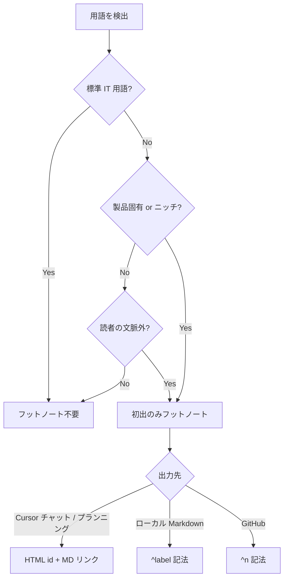

# フットノート記法

出力先ごとに記法が異なる。混在させない。

## 出力先別ルール

| 出力先                             | フットノート記法                      |
| ---------------------------------- | ------------------------------------- |
| Cursor チャット / プランニング     | HTML `id` アンカー + Markdown リンク  |
| ローカル Markdown (`.md` ファイル) | 一般 Markdown フットノート `[^label]` |
| GitHub (issue, PR, Discussion)     | GitHub Markdown フットノート `[^n]`   |

| 変換                 | 方針                                                   |
| -------------------- | ------------------------------------------------------ |
| Cursor → GitHub      | HTML 形式を `[^n]` へ書き換え                          |
| Cursor → ローカル MD | HTML 形式を `[^label]` へ書き換え                      |
| ローカル MD → GitHub | `[^label]` を `[^n]` へ書き換え (出現順に連番振り直し) |

ローカル MD へ直接書く場合は最初から `[^label]` を使う。Cursor チャットでは HTML 形式を使う。GitHub 投稿前は必ず対象出力先の記法へ変換する。

### 変換マッピング

| 変換元                               | 本文                                            | 定義                       |
| ------------------------------------ | ----------------------------------------------- | -------------------------- |
| Cursor `[用語](#footnote-slug)`      | ローカル MD: `用語[^slug]` / GitHub: `用語[^n]` | —                          |
| Cursor `<a id="footnote-slug"></a>…` | ローカル MD: `[^slug]: …` / GitHub: `[^n]: …`   | —                          |
| ローカル MD `用語[^label]`           | GitHub: `用語[^n]`                              | 出現順に `[^1]`, `[^2]`, … |
| ローカル MD `[^label]: …`            | GitHub: `[^n]: …`                               | 定義文はそのまま           |

- ローカル MD で既に `[^1]` 等を使っていても、GitHub 投稿前に連番と定義行の対応を確認する

## 判定フロー



## Cursor チャット / プランニング

Cursor 上の計画出力・Plan モード応答向け。HTML `id` + Markdown リンク。

### パターン

1. 本文: `[表示テキスト](#footnote-<slug>)`
1. 末尾「用語」節: `<a id="footnote-<slug>"></a>**表示テキスト** — 定義`

`<slug>` は ASCII kebab-case。日本語 id は使わない。

### 例

```markdown
[hibernation](#footnote-hibernation) 中は [eviction](#footnote-eviction) されうる。

## 用語

<a id="footnote-hibernation"></a>**hibernation** — Durable Object がアイドル時にメモリから退避し、次リクエストで再開する状態。
<a id="footnote-eviction"></a>**eviction** — キャッシュや DO インスタンスが容量・TTL・アイドル条件で破棄されること。
```

## ローカル Markdown

リポジトリ内 `.md` ファイルへ計画を書く場合。Pandoc / GitHub Flavored Markdown 互換の **`[^label]` 記法**。

### パターン

1. 本文: `用語[^label]`
1. 末尾: `[^label]: **用語** — 定義`

`label` は ASCII kebab-case 推奨。番号 `[^1]` も可。

### 例

```markdown
Durable Object[^durable-object] でセッション状態を保持する。

[^durable-object]: **Durable Object** — Cloudflare Workers 上の状態付きシングルインスタンス実行環境。同一 ID へのリクエストは順序保証される。
```

### 注意

- HTML `<a id>` は使わない
- 「用語」見出し節は不要。定義は `[^label]:` 行を本文末尾へ
- GitHub 転記時は `[^label]` → `[^n]` へ変換する (上記「出力先別ルール」参照)

## GitHub (issue / PR / Discussion)

GitHub 投稿向け。**連番 `[^n]` 記法**。ローカル MD の `[^label]` をそのまま貼らない。

### 例

```markdown
Durable Object[^1] でセッション状態を保持する。

[^1]: **Durable Object** — Cloudflare Workers 上の状態付きシングルインスタンス実行環境。同一 ID へのリクエストは順序保証される。
```

### GitHub 注意

- フットノート定義は本文末尾に置く
- `[^n]:` の後ろは 1 行定義を基本とする
- HTML `<a id>` は GitHub 本文では使わない

## 書かないもの

- `git`, `React`, `API`, `middleware` など [term-glossary.md](term-glossary.md) の「不要」語
- 同一計画内 2 回目以降の同一用語 (リンクも不要)
- 自明な略語の再定義 (例: PR = Pull Request)
